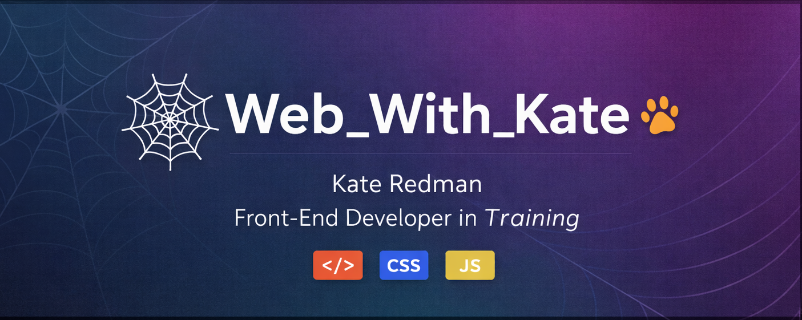

# Hi, I'm Kate 👋

Front-End Developer in Training | Web_With_Kate

🇬🇧 Welsh-born living in Canada since 2005  
👩‍💻 Web Development student at triOS College  
🐶 Dog lover (Shaggy approved)  
🎨 Passionate about UI/UX and clean, accessible design  

## Currently Learning
- HTML
- CSS
- JavaScript
- Git & GitHub
- Responsive design
- Figma to code workflows

## Current Projects
- Personal Portfolio Website
- Git Workflow Assignments
- Shaggy's PawPrint Planner
- Smart Pet Feeder

## Goals
Build modern, accessible websites and grow into a professional front-end developer.

---

© 2026 Kate Redman | Web_With_Kate
